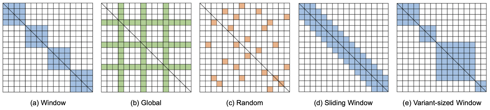
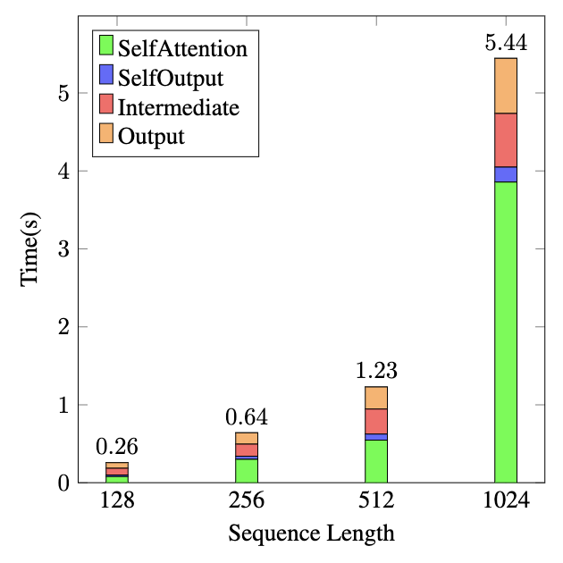
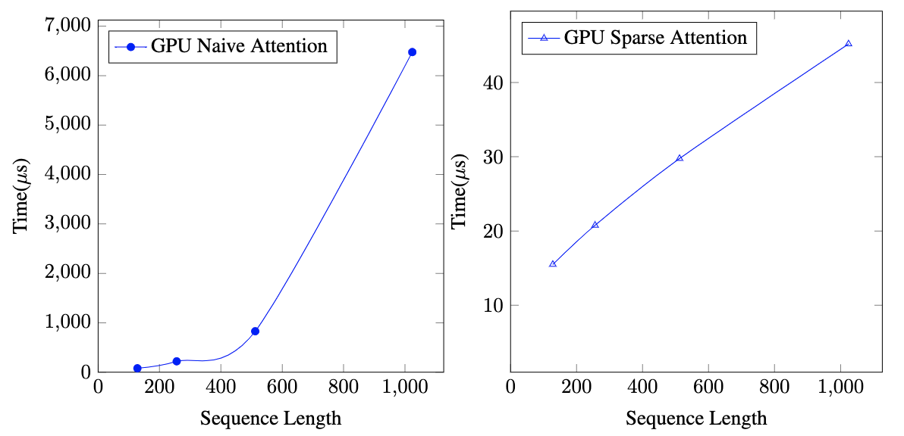
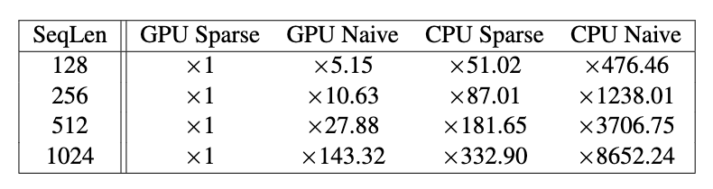
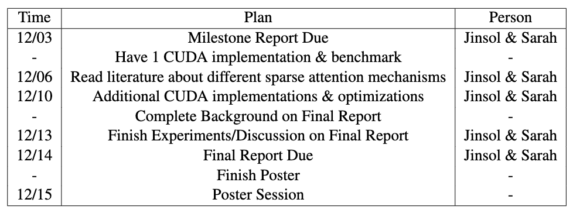

# 15618 Project: Sparse Attention in CUDA
Sarah Di (sarahdi), Jinsol Park (jinsolp)

[Webpage](https://github.com/disarah/15618_Project)
[Overleaf](https://www.overleaf.com/project/654ad93dc7593c6b143abdee)

## Summary
We are going to implement sparse attention on CPU and GPU platforms using python and CUDA respectively, and perform analysis on both system’s performance characteristics.

## Background
Attention requires time and memory that that scales quadratically with sequence length Child et al. [2019]. Sparse attention is similar to the original attention, but it factorizes the attention matrix to compute certain parts of the matrix instead of computing the entire n × n matrix. Different factorization methods lead to different sparse attention modes.

Figure 1: Different factorization methods of sparse attention. Each connectivity matrix shows whether an ith token (row) of a sequence refers to a jth token (column) to compute an attention score. These can be combined to be a single sparse attention method.

---
The figure above illustrates different sparse attention factorization methods. We think that instead of naively implementing this by checking every element, parallelizing matrix multiplication by taking sparsity into account is important in gaining high speedup. Thus, we are planning to implement CPU and GPU versions of sparse attention by actually checking only the elements that matter, which are decided in advance by user configurations. Based on this implementation, we are planning to analyze how much speedup sparse attention brings compared to naive matrix multiplication.

## Challenge
First, implementing sparse attention in CUDA itself is challenging. As aforementioned, we are planning to consider sparsity itself when doing matrix multiplication. This means that we will be looking at elements in certain strides under different configurations. The main aspect that needs to be considered when implementing sparse attention will be locality. Since in essence, we will be doing sparse matrix multiplication under a certain rule, exploiting shared memory will become much more complex compared to naive matrix multiplication. 

Also, we plan to implement different sparse attention methods and analyze them agains the CPU version. We believe that profiling the execution time and the kernel in detail will also be challenging. 

Overall, we wish to deepen our understanding of attention and how matrix multiplication can be parallelized, while also learning how to exploit shared memory on CUDA.

## Resources
### Tutorials
We plan to start by looking into the following sparse attention tutorials in DeepSpeed. [Deepspeed Tutorial](https://www.deepspeed.ai/tutorials/sparse-attention/) 
[Deepspeed Repo](https://github.com/microsoft/DeepSpeed/tree/master/deepspeed/ops/sparse_attention)

Also, since we are planing to use the C++ frontend of PyTorch to make it compatible with our custom CUDA kernels, we plan to look into the following [C++ PyTorch tutorial](https://pytorch.org/tutorials/advanced/cpp_frontend.html)

### Code Base
We plan to implement our own Attention module in C++ using PyTorch C++ frontend APIs. To analyze the bottleneck of attention within the entire transformers layer, we plan to use the Huggingface Transformers library, and run a simple model.
### Papers
We plan to read and refer to the following papers; Vaswani et al. [2017], Child et al. [2019], Beltagy et al.[2020], Zaheer et al. [2020].

## Goals and Deliverables
### Goals
The goals of this project are listed below:
**Plan to Achieve**
- Read related papers and work on tutorials to deepen our understanding
- Implement sparse attention on CPU
- Implement sparse attention on GPU using CUDA
- Optimize GPU verison of sparse attention by exploiting shared emmory
- Analyze the speedup gains of sparse attention against naive attention, and also observe different gains on CPU and GPU
- Analyze on different input sequence lengths to observe larger gains with longer sequence lengths

**Hope to Achieve**
- Implement multiple versions of sparse attention, and compare their performance gains
- Profile our sparse attention CUDA kernel with Nsight Compute to find room for further optimization

### Deliverables
At the poster session we will be showing speedup graphs. We plan to plot these graphs to show speedup against the naive matrix multiplication, and also to show different gains between CPU and GPU. We also plan to show different speedup gains depending on different sequence lengths. We hope to verify that sparse attention brings significant speedup compared to the original matrix multiplication.

## Platform Choice
We plan to implement our own CUDA kernels for sparse attention. Also, we plan to used the C++ frontend of PyTorch since it is easy to use when building deep learning models, and directly compatible with CUDA kernels (we do not have to make python - C++ bindings).

## Schedule
Our planned schedule is as follows:
| Time | Plan |
| ----------- | ----------- |
| 11/15 | Project Proposal Due|
| 11/19 | Work on tutorials, understanding sparse attention|
| - | Get used to C++ frontend for PyTorch |
| 11/26 | CPU version|
| 12/03 | Milestone Report Due |
| - | Have 1 CUDA implementation \& benchmark|
| 12/10 | Additional CUDA implementations \& optimizations|
| 12/14 | Final Report Due | 
| 12/15 | Poster Session |

# Milestone (12/03)
## Work Completed So Far
### Summary of work
We first validate the motivation for sparse attention with empirical data. The graphs which confirm that attention is a performance bottleneck can be seen in a later section.
We implemented the naive attention and the sparse attention on CPU and CUDA. For the naive attention, we implemented general matrix multiplication and the softmax using a tiling scheme to exploit shared memoryefficiently.
For this milestone, we focused on the window attention method as seen in (a) of Figure 1 for sparse attention. Since query and key matrices are dense but the resulting attention scores matrix is sparse, we cannot use general matrix multiplication. Instead, we implemented a MultiHeadDDS kernel, which performs dense × dense = sparse matrix multiplication based on the given window size. We also implemented a MultiHeadSoftMaxSparse kernel, which performs sparse softmax on the sparse attention scores matrix. Finally, we also have a MultiHeadSDD kernel to perform matrix multiplication between the sparse attention scores matrix and the dense value matrix, returning a dense matrix as the final output. All matrix multiplication kernels use tiling optimizations, and uses the window size configuration to efficiently exploit shared memory.

## Preliminary Results

In Figure 2, we show the computational time of the layers present within a BERT encoder scaled by the sequence length of the inputs (ranging from 128 to 1024). Our visualization confirms that the computation time of the encoder’s attention layer, as shown in green, scales quadratically with respect to sequence length, and also that is takes up a large proportion of the computation time. We also include the computational times of other layers of the encoder, such as the Intermediate and Output (Add & Norm) layers, as shown in red and orange respectively, which combined comprise the Feed Forward part of an encoder. The SelfOutput layer, shown in blue, represents the Add & Norm Layer of Self Attention.

Figure 3 shows the execution time of attention on GPU for different attention methods. We measured the execution time for sequence lengths 128, 256, 512, and 1024. It can be observed that the GPU Naive Attention scales quadratically with sequence length, while the GPU Sparse Attention implementation (with window size 16) scales linearly with sequence length. Also, it takes much less time compared to the full naive attention.

The table above provides further information about the execution time on CPU Sparse and Naive Attentions. We provide a speedup brought by GPU Sparse Attention compared to each implementation for different sequence lengths.

## Revised Schedule

